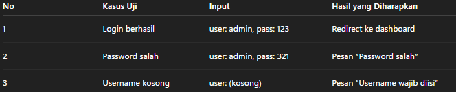

🧩 KASUS UJI KOMPETENSI – PLATFORM WEB
🌐 Judul: Aplikasi Web “Sistem Informasi Data Siswa”
Deskripsi Kasus:

Sebuah sekolah menengah kejuruan ingin memiliki aplikasi berbasis web untuk mengelola data siswa.
Aplikasi ini akan digunakan oleh staf tata usaha untuk:

Menambah data siswa baru,

Mengubah data siswa,

Menghapus data siswa yang sudah lulus, dan

Mencari data siswa berdasarkan NISN atau nama.

Sekolah meminta Anda sebagai Junior Web Programmer untuk membuat versi awal sistem tersebut dengan ketentuan berikut.

1. Analisis Spesifikasi Program

(Unit: J.620100.009.01)
Tuliskan spesifikasi teknis program berdasarkan kebutuhan sekolah tersebut, meliputi:

Tujuan sistem

Fitur utama

Struktur tabel database (nama tabel, kolom, tipe data)

Diagram alur proses (flow sederhana input–proses–output)

2. Perancangan Struktur Data

(Unit: J.620100.004.02)
Gunakan struktur data array atau associative array di PHP untuk menampung data siswa sementara sebelum disimpan ke database.
Tampilkan daftar siswa dalam bentuk tabel HTML.
Tambahkan fitur pencarian berdasarkan nama.

3. Pembuatan Modul Login & Dashboard

(Unit: J.620100.010.02)
Buat halaman login dengan ketentuan:

Pengguna memasukkan username dan password.

Data diverifikasi dari database.

Jika berhasil, tampilkan halaman dashboard dengan menu “Data Siswa”.

Jika gagal, tampilkan pesan error.

4. Penulisan Kode Sesuai Best Practice

(Unit: J.620100.016.01)
Dalam proyek Anda:

Gunakan penamaan variabel dan fungsi yang konsisten (camelCase atau snake_case).

Tambahkan komentar penjelas pada setiap fungsi utama.

Pisahkan kode ke dalam folder models, views, dan controllers.

5. Implementasi Pemrograman Terstruktur

(Unit: J.620100.017.02)
Buat fungsi PHP hitungRataNilai($nilai) yang menerima array nilai siswa dan mengembalikan rata-ratanya.
Tampilkan hasilnya di halaman “Detail Siswa”.

6. Debugging Aplikasi

(Unit: J.620100.025.02)
Asesor memberikan potongan kode berikut yang tidak bisa menampilkan data siswa:
```bash
<?php
include 'koneksi.php';
$query = "SELEC * FROM siswa"; 
$result = mysqli_query($koneksi, $query);
while($row = $result){
  echo $row['nama'];
}
?>
```
7. Pengujian Unit Program

(Unit: J.620100.033.02)
Buat tabel rencana pengujian fungsi loginUser(), berisi minimal 3 skenario:



8. Dokumentasi Proyek

(Unit: J.620100.023.02)
Buat file README.md yang berisi:

Nama proyek dan deskripsi singkat

Panduan instalasi (import database, setting koneksi, cara menjalankan)

Struktur folder

Screenshot tampilan utama

Output Akhir:

Aplikasi web yang bisa dijalankan (login, CRUD siswa, cari siswa).

Database MySQL db_siswa.

File dokumentasi (README.md).

File hasil debugging (sebelum & sesudah).